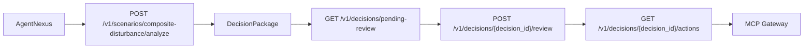

# AgentNexus 与 RelOS 对接规范

本文档定义 `AgentNexus -> RelOS` 的一期对接契约，覆盖：

- `ContextBlock`
- `DecisionPackage`
- `ActionBundle`
- 决策审核调用顺序
- 边界职责与异常语义

目标是让 `AgentNexus` 能把 `RelOS` 作为“关系上下文 + 结构化决策包 + Shadow 动作包”能力层接入，而不是重复实现关系推理或执行逻辑。

## 1. 边界职责

### RelOS 负责

- 关系图谱存储与检索
- 复合扰动事件的结构化分析
- `ContextBlock` 生成
- `DecisionPackage` 输出
- 决策级 HITL 队列与审核状态
- `ActionBundle` Shadow 输出与审计

### AgentNexus 负责

- 自然语言入口
- 顶层目标拆解与 Task DAG
- 多 Agent 协同编排
- 将 `RelOS` 的输出整合为主管可读的话术或任务面板
- 审核后继续编排后续流程

### 外部系统负责

- MES 排产改写
- MRO 工单落地
- WMS 物料调拨
- ERP 订单状态更新

所有真实执行均应经 MCP/受控网关实现，`RelOS` 一期只输出 `payload_preview`，不直接写生产系统。

## 2. 输入契约

一期复杂场景统一通过：

- `POST /v1/scenarios/composite-disturbance/analyze`

请求体为 `CompositeDisturbanceEvent`：

```json
{
  "incident_id": "incident-semicon-001",
  "factory_id": "fab-01",
  "scenario_type": "semiconductor_packaging",
  "priority": "high",
  "goal": "保障插单交付并控制设备与物料风险",
  "time_window_start": "2026-03-30T13:47:00+08:00",
  "time_window_end": "2026-03-30T13:51:00+08:00",
  "events": [
    {
      "event_id": "evt-001",
      "event_type": "rush_order",
      "source_system": "ERP",
      "occurred_at": "2026-03-30T13:47:00+08:00",
      "entity_id": "order-BGA-rush-500",
      "entity_type": "CustomerOrder",
      "severity": "high",
      "summary": "紧急插单 500 件 BGA",
      "payload": {}
    }
  ]
}
```

### `event_type` 建议值

- `rush_order`
- `machine_anomaly`
- `material_shortage`
- `quality_degradation`
- `tooling_shortage`

## 3. ContextBlock 契约

`RelOS` 当前输出的上下文仍是 Markdown block，而不是图结构 JSON。

字段如下：

| 字段 | 类型 | 说明 |
|---|---|---|
| `content` | `string` | 结构化 Markdown，上层可直接喂给 LLM/Agent |
| `relation_count` | `int` | 进入上下文的关系数 |
| `estimated_tokens` | `int` | 粗略 token 估计 |
| `pruned_count` | `int` | 被裁剪掉的关系数 |
| `query_strategy` | `string` | 查询策略，复杂场景一期使用 `composite_disturbance` |

### 语义约束

- `content` 面向上层 Agent，不保证适合前端直接渲染
- `query_strategy` 仅表达编译策略，不等价于推理引擎
- `estimated_tokens` 为预算参考，不是精确计费值

## 4. DecisionPackage 契约

`RelOS` 一期的结构化决策输出如下：

| 字段 | 类型 | 说明 |
|---|---|---|
| `decision_id` | `string` | 决策包 ID，当前规则为 `decision-{incident_id}` |
| `incident_id` | `string` | 复合事件 ID |
| `title` | `string` | 决策包标题 |
| `incident_summary` | `string` | 对事件与目标的摘要 |
| `risk_level` | `low\|medium\|high` | 风险等级 |
| `recommended_plan_id` | `string` | 推荐方案 ID |
| `candidate_plans` | `CandidatePlan[]` | 候选方案列表 |
| `recommended_actions` | `DecisionAction[]` | 推荐动作列表 |
| `evidence_relations` | `object[]` | 关键证据关系 |
| `requires_human_review` | `boolean` | 是否必须人工审核 |
| `review_reason` | `string` | 触发审核原因 |
| `trace_id` | `string` | 本次分析链路追踪 ID |
| `status` | `draft\|pending_review\|approved\|rejected\|shadow_planned\|executed\|rolled_back` | 决策包状态 |
| `context_block` | `string` | 编译后的上下文内容 |
| `context_query_strategy` | `string` | 上下文编译策略 |
| `context_relations_count` | `int` | 上下文关系数量 |

### CandidatePlan

| 字段 | 类型 |
|---|---|
| `plan_id` | `string` |
| `name` | `string` |
| `summary` | `string` |
| `assumptions` | `string[]` |
| `risk_level` | `low\|medium\|high` |
| `estimated_delivery_impact` | `string` |
| `estimated_quality_impact` | `string` |
| `estimated_capacity_impact` | `string` |

### DecisionAction

| 字段 | 类型 |
|---|---|
| `action_id` | `string` |
| `action_type` | `string` |
| `target_system` | `string` |
| `target_entity` | `string` |
| `summary` | `string` |
| `risk_level` | `low\|medium\|high` |
| `requires_human_review` | `boolean` |
| `payload_preview` | `object` |

## 5. ActionBundle 契约

`ActionBundle` 是对 `recommended_actions` 的 Shadow 包装。

| 字段 | 类型 | 说明 |
|---|---|---|
| `bundle_id` | `string` | 动作包 ID |
| `decision_id` | `string` | 关联决策包 ID |
| `status` | `draft\|pending_review\|shadow_planned\|rejected` | 当前 Shadow 状态 |
| `actions` | `DecisionAction[]` | 动作列表 |
| `shadow_mode` | `boolean` | 是否仅 Shadow 输出 |
| `execution_notes` | `string` | Shadow 语义说明 |

### 语义约束

- `shadow_mode=true` 不等于动作已执行
- `payload_preview` 仅供上层系统生成真实 MCP 请求
- `status=shadow_planned` 表示人工已确认，可进入上层执行编排

## 6. 调用顺序



### 推荐顺序

1. `AgentNexus` 汇总多源事件，构造 `CompositeDisturbanceEvent`
2. 调用 `POST /v1/scenarios/composite-disturbance/analyze`
3. 读取 `DecisionPackage`
4. 若 `requires_human_review=true`
   调用 `GET /v1/decisions/pending-review` 获取待审队列
5. 人工选择方案后调用 `POST /v1/decisions/{decision_id}/review`
6. 审核通过后调用 `GET /v1/decisions/{decision_id}/actions`
7. `AgentNexus` 再将 `ActionBundle.actions[].payload_preview` 转成 MCP 实际调用

## 7. 审核接口

### 获取待审决策

- `GET /v1/decisions/pending-review`

### 提交审核

- `POST /v1/decisions/{decision_id}/review`

请求体：

```json
{
  "reviewed_by": "supervisor-li",
  "selected_plan_id": "plan-balance-repair-and-expedite",
  "approved_actions": [
    "act-maint-smt02-feeder",
    "act-allocate-0402"
  ],
  "rejected_actions": [],
  "review_comment": "允许先维修再并行排产",
  "approve": true
}
```

## 8. 两套标准样例

### 半导体封装

样例数据文件：

- `relos/demo_data/composite_decision_packages.json`

键名：

- `semiconductor_packaging`

### 汽车零部件

样例数据文件：

- `relos/demo_data/composite_decision_packages.json`

键名：

- `auto_parts_manufacturing`

## 9. 异常与兼容规则

- `404`：指定 `incident_id`、`decision_id` 或 `bundle` 不存在
- `requires_human_review=true`：表示必须升级到人工确认，不表示分析失败
- `review_reason`：上层必须向用户展示，不应吞掉
- `context_block`：可直接给上层 LLM 作为补充上下文，但不应被误解成完整图谱快照
- 一期 `RelOS` 不负责：
  - 多 Agent DAG
  - 对话式 `/decide`
  - 真实系统写回
  - 执行结果编排

## 10. 一期兼容建议

若 `AgentNexus` 仍需兼容旧单告警链路，可并行保留：

- `POST /v1/decisions/analyze-alarm`

但对复合扰动场景，应统一升级到：

- `POST /v1/scenarios/composite-disturbance/analyze`

避免把多事件场景压扁成单告警分析。
