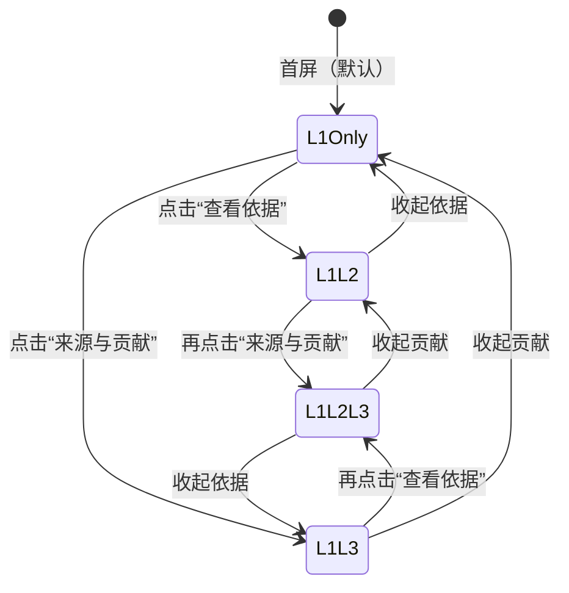
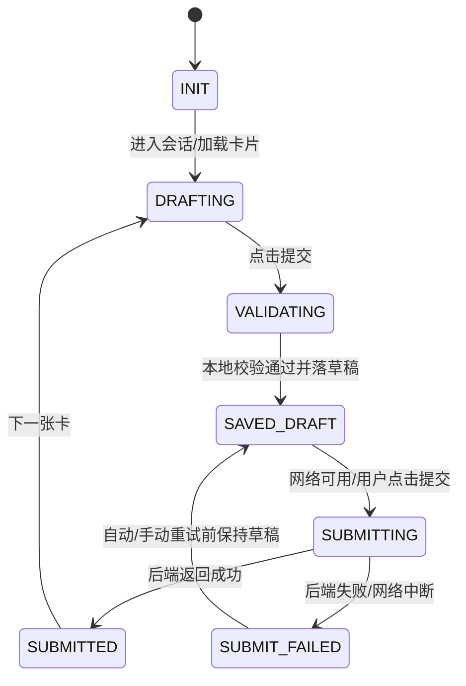

# 流式交互（Streaming UX）低保真线框（入库版）

**版本**：v0.1  
**日期**：2026-03-25  
**目的**：对齐关键布局与控件位置，服务 Phase 1（阶段 4 SSE 真流式最小闭环）实现。  

---

## 1. 阶段 4：同屏布局（上：决策卡；下：问答流）

```mermaid
flowchart TB
  subgraph Screen[决策页（Web 桌面优先，PDA 约束：按钮更大、信息更少）]
    direction TB
    subgraph Top[上半屏：决策卡（L1→L2→L3 渐进展开）]
      direction TB
      Header[Header\n设备名 + 告警码 + 严重度 Badge + 时间]
      Summary[L1：推荐根因（大字）\n置信度条/百分比 + 引擎类型 + requires_human_review\nShadow Mode Banner]
      Actions[操作区\n[✓ 确认] [✗ 否定] [？不确定]]
      EvidenceToggle[折叠区入口：查看依据（L2）]
      ContribToggle[折叠区入口：来源与贡献（L3）]
      EvidenceList[L2：证据关系列表（默认最多 3 条）\n每条：relation_type + confidence + phase + provenance_detail]
      ContribPanel[L3：阶段贡献\nphase_contributions + confidence_trace_id（可复制）]
    end

    subgraph Bottom[下半屏：问答流（SSE 输出 + 同步回答）]
      direction TB
      StreamHeader[问答流标题\n“用于澄清上下文/选择下一步动作”]
      StreamTimeline[事件时间线\nsummary → evidence* → contributions → question → done]
      QuestionCard[当前问题卡\n单选/多选/填空（可跳过）\n说明：为什么问这个]
      AnswerBar[回答输入区\n按钮/输入框 + 提交]
    end
  end
```

---

## 2. 决策卡的折叠层级（默认折叠策略）



---

## 3. 阶段 2：微卡片向导（类流式，15 秒微任务）

```mermaid
flowchart TB
  subgraph Wizard[访谈/专家初始化：微卡片向导]
    direction TB
    Progress[顶部：进度/会话信息\nSessionId + 已完成/总数 + 离线状态]
    Card[当前卡片（一次一个微任务）]
    subgraph CardTypes[卡片类型]
      direction TB
      Confirm[关系确认卡\n候选关系展示 + 3 按钮\nconfirm / reject / unsure]
      Create[关系新建卡\n模板句填空 + 默认值\nknowledge_phase=interview, phase_weight=0.90]
      Enrich[关系补充卡\n否定后给替代建议（可一键采纳）]
    end
    Draft[草稿提示\n“已自动保存” / “离线：等待同步”】【撤销/重做（可选）】
    Nav[底部：上一张/下一张\n跳过 / 保存并继续]
  end
```

---

## 4. 微卡片状态机（与设计计划对齐）



